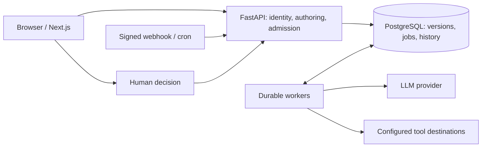

# AgentOps Workflow Platform

[](https://github.com/christiankfoury/agentops-workflow-platform/actions/workflows/ci.yml)

A durable AI workflow platform for building, running, debugging and evaluating
business automations with LLM, deterministic, tool and human-approval steps.

**The engineering question:** after a timeout, approval edit or worker crash, can
we explain what happened and continue without silently changing the workflow or
repeating an uncertain external action?

AgentOps answers with immutable published graphs, PostgreSQL-backed jobs,
lease fencing, retained attempts, exact-input approvals and an effect ledger.
The original sales, feedback and incident agents are examples on this runtime.
See the [product overview](docs/overview.md), [architecture](docs/ARCHITECTURE.md)
and [R01–R14 evidence index](docs/PLATFORM_EVIDENCE.md).

## Recorded results

| Check | Result | What it establishes |
| --- | --- | --- |
| [Deterministic benchmark](docs/BENCHMARK_RESULTS.md) | 10,000 completed workflows, 33,333 jobs, 3,333 sink effects; zero loss/duplication | Controlled local service-level execution, not 10,000 simultaneous LLM calls |
| [Fault experiments](docs/RELIABILITY_RESULTS.md) | 45 cases; 72 accepted runs accounted for, including expected failures/cancellations | Recovery and uncertainty handling under injected faults; three intentionally unknown outcomes remain unknown |
| [Kubernetes operations](docs/KUBERNETES_OPERATIONS_RESULTS.md) | 21 completed runs, 21 effects from 23 requests; rollout, scaling, fencing and restore passed | Authenticated single-node local deployment with synthetic identity and an idempotent sink |
| [Evaluation](docs/EVALUATION.md) | Baseline/multi-agent scoring and comparisons; 30 base cases plus two showcase cases | Seeded UI examples and tested scoring, not measured live-model quality improvement |

At executor capacities 1, 4 and 16, the benchmark observed **1.351, 4.240 and
5.666 workflows/second** on one shared host. The method, raw archives, source
hashes and limitations accompany each result. Hosted deployment and paid-provider
acceptance are not claimed. Commit, CI and review evidence is in the
[phase ledger](docs/phase-progress.md).

## Build and inspect automations

- **Author:** eight typed primitives, constrained expressions, bindings, retry
  policies, delays, approvals and parallel joins. Save revisioned drafts and
  publish immutable versions through the [builder](docs/WORKFLOW_BUILDER.md).
- **Run:** manual starts, signed webhooks and timezone-aware cron use the same
  versioned idempotent admission contract. Workers persist leases, retries and
  checkpoints; waits release capacity. [Execution contract](docs/EXECUTION_RECORDS.md).
- **Act:** governed HTTP REST, restricted PostgreSQL reads and GitHub issue tools;
  declared LLM tool calls use the same schema, permission and budget checks.
  [Tool contracts](docs/TOOL_CONTRACTS.md).
- **Review:** approved payload hashes bind a decision to the displayed input.
  Edits supersede old approvals; writers consume the approved content.
  [Business templates](docs/BUSINESS_TEMPLATES.md).
- **Debug:** pinned graph, selected edges, steps, attempts, tools, errors and
  approvals; authorized cancellation and explicit linked recovery.
  [Debugger](docs/WORKFLOW_DEBUGGER.md) · [Recovery](docs/WORKFLOW_RECOVERY.md).
- **Operate:** tenant-scoped queue/worker views and bounded live updates.
  [Operations](docs/WORKER_OPERATIONS.md).
- **Authorize:** verified OIDC sessions, organization memberships, server-owned
  roles, service scopes and audit history. [Identity](docs/IDENTITY.md).



The cron scheduler runs in workers; the trigger arrow represents the shared
admission contract, not a scheduler making public HTTP requests. Detailed
transaction and trust boundaries are in the [architecture](docs/ARCHITECTURE.md).

## Business workflows and evaluation

| Template | Multi-agent path | Output |
| --- | --- | --- |
| Sales | Analyst → reviewer → approval → writer | Executive summary |
| Feedback | Classifier → insight → reviewer → approval → writer | Product insights |
| Incident | Timeline → root cause → reviewer → approval → writer | Post-incident report |

Each has a one-step baseline. Quality revisions are bounded separately from
infrastructure retries. Published business templates require approval; human
edits and old attempts remain inspectable. Existing business dashboards, prompt
settings, exports and historical runs remain available through compatibility
projections without inventing graph versions for old records.


This retained screenshot shows business/demo data. The [business screenshot tour](docs/BUSINESS_TOUR.md)
and [demo walkthrough](docs/demo-walkthrough.md) distinguish seeded examples from
live runs. Reviewer quality, deterministic expected-item scores and observed
cost/latency answer different questions; none alone proves a model is reliable.
See [evaluation methodology and illustrative values](docs/EVALUATION.md).

## Start locally

The root Compose profile is **loopback-only development**, with local credentials
and development identity behavior. It is not the production profile.

```powershell
# From the repository root; preserve an existing environment file.
if (-not (Test-Path .env)) { Copy-Item .env.example .env }
docker compose up -d --build
```

Open [the web app](http://localhost:3000) or
[API health](http://localhost:8000/health). API startup applies migrations;
the separate worker executes accepted durable jobs. Open `/demo` to seed
illustrative business records without provider calls, then visit:

| Route | View |
| --- | --- |
| `/workflow-definitions` | Draft builder, validation, publication and manual starts |
| `/execution-traces` | Generic graph runs and debugger |
| `/workflow-triggers` | Webhook/cron configuration and delivery history |
| `/operations` | Queue and worker observations |
| `/workflow-runs` | Business run history and canonical trace links |
| `/human-approvals` | Business review queue |
| `/workflow-comparison`, `/evaluation`, `/costs` | Quality and cost views |
| `/account` | Identity and organization selection when enabled |

For native development, migrations, template installation and environment setup,
use [deployment](docs/DEPLOYMENT.md). Live model runs require deliberately
configured worker credentials and quota; the demo seed does not. Optional
external usage reporting is documented in [telemetry](docs/TELEMETRY.md).

## Deploy and verify

- [Production containers](docs/PRODUCTION_CONTAINERS.md) and
  [measured results](docs/PRODUCTION_CONTAINER_RESULTS.md).
- [Kubernetes local/hosted profiles](docs/KUBERNETES.md) and
  [local acceptance](docs/KUBERNETES_RESULTS.md).
- [Operations runbook](docs/KUBERNETES_OPERATIONS.md) and
  [recovery/backup/rollback results](docs/KUBERNETES_OPERATIONS_RESULTS.md).

Production startup requires verified identity, HTTPS configuration and protected
secrets. The hosted profile is documented but not deployed. Local acceptance
uses synthetic TLS/OIDC and a single-node cluster; it does not establish public
security or multi-node availability. See [security policy](SECURITY.md).

## Development and validation

Python 3.12, FastAPI, SQLAlchemy/Alembic and PostgreSQL 16; Next.js 16, React 19,
TypeScript and Tailwind; Node.js 24 in CI/production images; uv and pnpm lockfiles.
The graph interpreter and worker are application code, without LangGraph/Celery.

```powershell
uv run --directory apps/api pytest
uv run --directory apps/api ruff check src tests
pnpm --dir apps/web typecheck
pnpm --dir apps/web test:smoke
uv run --directory apps/api python ../../scripts/check_documentation.py
```

Database concurrency tests require disposable PostgreSQL via
`WORKFLOW_TEST_DATABASE_URL`; CI supplies it, migrates a fresh database, runs
application checks/builds, renders deployment profiles and audits dependencies.
The [documentation checker](scripts/check_documentation.py) verifies local links,
anchors, fences, phase numbering and requirement-table coverage; factual claims
still require source/evidence review.
If a bare local suite hangs, use explicit files and record that limitation.

## Guarantees and remaining boundaries

Delivery is at least once. Stable local keys cannot guarantee exactly-once remote
writes. Adapters require provider idempotency or reconciliation; unresolved
outcomes remain explicit. Cancellation cannot reverse a completed external action.
Unknown usage/cost remains unknown. Linked recovery preserves the source history
and requires fresh approvals instead of reopening a terminal run.

The [implementation plan](WORKFLOW_PLATFORM_IMPLEMENTATION_PLAN.md) owns R01–R14;
[phase progress](docs/phase-progress.md) owns completion and CI evidence.
Read the [final platform case study](docs/CASE_STUDY.md) for design decisions,
measured results, tradeoffs, lessons and the complete R01–R14 checklist.
For a five-minute product demonstration, use the [recording script](docs/DEMO_SCRIPT.md)
and [reproducible local walkthrough](docs/demo-walkthrough.md), with synthetic
model responses clearly separated from measured runtime experiments.
[Deferred work](docs/deferred-phases.md) covers notifications, caching, advanced
judging, additional connectors and hosted acceptance. No live-provider quality
uplift, arbitrary uploaded code execution or production security certification
is asserted.
