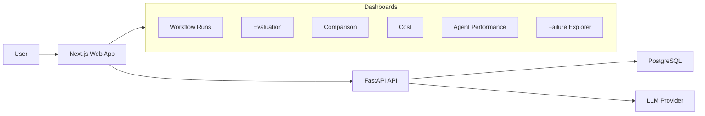
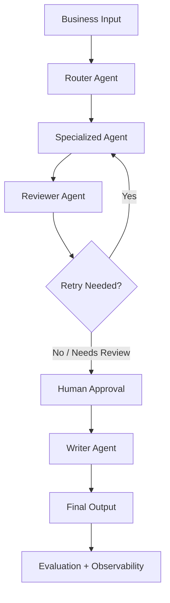

# AgentOps Workflow Platform

An enterprise-style multi-agent workflow platform for turning business documents
into reviewed, measurable outputs. The project compares a single-agent baseline
against a multi-agent workflow with specialized agents, reviewer checks, retry
logic, human approval, deterministic evaluation, cost tracking, and observability.

The portfolio claim this repo is built to prove:

> Multi-agent workflows cost more and take longer than a single prompt, but they
> produce safer, more complete, and more trustworthy business outputs.

## What It Does

AgentOps supports three business workflows:

| Workflow | Input | Output |
| --- | --- | --- |
| Sales Report | Revenue, pipeline, churn, regional performance | Executive summary |
| Customer Feedback | CSV/text reviews, tickets, NPS comments | Product insights report |
| Incident Log | Timestamped operational events | Post-incident report |

For each workflow, the app stores the input, every agent step, reviewer findings,
human approval decisions, final output, evaluation scores, costs, latency, retries,
and workflow events.

## Current Demo Results

The seeded demo dataset contains 32 evaluation cases: 10 sales reports, 10 customer
feedback datasets, 10 incident logs, and 2 sales remediation showcase cases. Each
case includes expected facts, risks, recommendations, and workflow-specific
expectations such as feedback themes or incident timeline events.

| Metric | Single-Agent Baseline | Multi-Agent Workflow |
| --- | ---: | ---: |
| Factual accuracy | 70% | 92% |
| Unsupported claim rate | 22% | 5% |
| Completeness | 64% | 88% |
| Average cost | $0.035 | $0.128 |
| Average latency | 4.2s | 18.4s |

These are deterministic seeded demo values intended to make the portfolio demo
immediately explorable. Live LLM-backed runs can produce different results.

## Architecture





## Key Features

- Multi-workflow support for sales reports, customer feedback, and incident logs.
- Router confidence thresholds for auto-select, confirmation, and manual fallback.
- Specialized analyst/classifier/timeline/root-cause agents per workflow.
- Reviewer agents that flag unsupported claims and low-quality analysis.
- Score-based retry logic and safe workflow state transitions.
- Human approval with structured analysis editing before writer execution.
- Writer agents that produce final business-ready reports.
- Single-agent baseline runs for comparison.
- Evaluation cases and results across all three workflows.
- Deterministic checks for expected facts, themes, timeline events, and unsupported
  generated numbers.
- Cost, token, latency, retry, failure, and schema validation tracking.
- Prompt version management and prompt-version performance comparison.
- Failure case explorer and improvement tracking dashboards.
- Demo mode that seeds polished data for portfolio walkthroughs.

## Screenshots To Capture

Capture these screens after running Demo Mode:

| Screen | Route | What To Show |
| --- | --- | --- |
| Demo Mode | `/demo` | One-click sales, feedback, incident, and full evaluation demo controls |
| Evaluation Dashboard | `/evaluation` | Baseline vs multi-agent metric tradeoffs |
| Workflow Comparison | `/workflow-comparison` | Side-by-side baseline and multi-agent outputs |
| Workflow Detail | `/workflow-runs/:id` | Agent timeline, events, cost, retry, and final output links |
| Human Approval | `/human-approvals` | Reviewer issues, human edits, approvals, retries, rejects |
| Agent Performance | `/agent-performance` | Latency, cost, retry, failure, and schema validation metrics |
| Failure Explorer | `/failures` | Low-quality runs and common failure categories |
| Improvement Tracking | `/improvements` | Evaluation trends over time |

## Evaluation Methodology

Each evaluation case stores:

- Source input text.
- Expected facts.
- Expected risks.
- Expected recommendations.
- Expected feedback themes for customer feedback workflows.
- Expected timeline events for incident workflows.
- Notes that define unsupported-claim guardrails.

The evaluation system compares baseline and multi-agent outputs using:

- Factual accuracy.
- Unsupported claim rate.
- Completeness.
- Human approval rate.
- Average retries.
- Average cost.
- Average latency.
- Router accuracy and confidence.

Deterministic checks complement LLM judging by verifying expected numeric facts,
feedback themes, incident timeline timestamps/events, and unsupported generated
numbers.

## Tech Stack

| Layer | Technology |
| --- | --- |
| Frontend | Next.js 16, React 19, TypeScript, Tailwind CSS |
| Backend | FastAPI, Python 3.12, Pydantic, SQLAlchemy, Alembic |
| Database | PostgreSQL 16 |
| LLM integration | OpenAI client behind a local abstraction |
| JavaScript package manager | pnpm workspaces |
| Python package manager | uv |
| Validation | pytest, Ruff, TypeScript, Node smoke tests |

## Project Structure

```text
apps/
  api/          FastAPI backend, models, routers, services, tests
  web/          Next.js frontend, dashboard routes, API client
packages/
  shared/       Shared TypeScript package
docs/           Project specs, phase plan, progress tracker
docker/         Docker support
scripts/        Utility scripts
```

## Quick Start With Docker

```bash
git clone <repo-url>
cd agentops-workflow-platform
cp .env.example .env
make up
```

Services:

- Web: `http://localhost:3000`
- API: `http://localhost:8000`
- API health: `http://localhost:8000/health`

## Local Development

Install dependencies:

```bash
pnpm install
cd apps/api
uv sync
cd ../..
```

Start the API:

```bash
cd apps/api
uv run uvicorn src.main:app --reload --host 127.0.0.1 --port 8000
```

Start the web app:

```bash
pnpm --dir apps/web dev --hostname 127.0.0.1 --port 3000
```

If the web app runs outside Docker, set the API URL when needed:

```bash
NEXT_PUBLIC_API_URL=http://127.0.0.1:8000 pnpm --dir apps/web dev
```

## Production AI Platform Telemetry

AgentOps can optionally send safe, best-effort LLM usage telemetry to the
Production AI Platform. Telemetry is disabled by default, and AgentOps workflows
continue normally if the platform is unavailable.

Local placeholder configuration:

```env
AGENTOPS_TELEMETRY_ENABLED=false
AGENTOPS_TELEMETRY_ENDPOINT=http://localhost:8000/v1/usage/llm-events
AGENTOPS_TELEMETRY_API_KEY=agentops-local-placeholder-key-not-a-secret
AGENTOPS_TELEMETRY_TIMEOUT_SECONDS=2
AGENTOPS_TELEMETRY_MAX_METADATA_BYTES=2048
AGENTOPS_TELEMETRY_REDACT_CONTENT=true
```

When AgentOps runs in Docker and Production AI Platform runs on the host, use:

```env
AGENTOPS_TELEMETRY_ENDPOINT=http://host.docker.internal:8000/v1/usage/llm-events
```

The telemetry client only sends operational metadata such as workflow IDs, agent
step IDs, agent name/type, token counts, latency, cost estimate, status, retry
count, and safe error categories. It does not send prompts, generated outputs,
workflow input/output JSON, tool arguments, tool results, provider payloads, API
keys, or OpenAI credentials.

Structured JSON model calls are represented as `agent_step` events with
`response_type=structured_json`; writer and baseline text calls use
`response_type=text`. Workflow summary events are aggregate-only terminal status
events. They intentionally omit token and cost fields so Production AI Platform
does not double-count spend already reported by per-step events.

Send one local smoke event after the Production AI Platform API is running and
seeded with the AgentOps placeholder key:

```powershell
S:\github-repos\agentops-workflow-platform\apps\api\.venv\Scripts\python.exe scripts\send_platform_telemetry_smoke.py
```

## Demo Mode

Seed polished demo data from the UI:

1. Open `http://localhost:3000/demo`.
2. Run one workflow demo or the full evaluation demo.
3. Open `/workflow-comparison` or `/evaluation` to inspect results.

For a scripted reviewer/remediation demo path, follow
[`docs/demo-walkthrough.md`](docs/demo-walkthrough.md).

Seed from the API CLI:

```bash
cd apps/api
uv run python -m src.seed_demo_dataset
```

Demo seeding is idempotent. Re-running it refreshes the demo records instead of
duplicating demo runs and results.

## Validation

Backend tests:

```bash
S:\github-repos\agentops-workflow-platform\apps\api\.venv\Scripts\python.exe -m pytest
```

Production AI Platform telemetry mocked receiver check:

```bash
S:\github-repos\agentops-workflow-platform\apps\api\.venv\Scripts\python.exe scripts\test_phase45_mocked_platform_receiver.py
```

Docker Compose config check with placeholder env values:

```bash
docker compose --env-file .env.example config
```

Backend lint:

```bash
S:\github-repos\agentops-workflow-platform\apps\api\.venv\Scripts\python.exe -m ruff check S:\github-repos\agentops-workflow-platform\apps\api\src S:\github-repos\agentops-workflow-platform\apps\api\tests
```

Frontend typecheck:

```bash
pnpm --dir S:\github-repos\agentops-workflow-platform\apps\web typecheck
```

Frontend smoke tests:

```bash
pnpm --dir S:\github-repos\agentops-workflow-platform\apps\web test:smoke
```

## Why This Project Matters

The app is intentionally not a chatbot. It treats AI output as a stateful business
workflow that can be inspected, retried, approved, measured, and compared against
a baseline. That is the practical engineering story: better control and higher
trustworthiness in exchange for extra cost and latency.

## Lessons Learned

- Agent quality is easier to improve when every intermediate output is stored and
  reviewable.
- Reviewer agents are most useful when paired with deterministic checks for facts,
  numbers, themes, and timeline events.
- Human approval is not a fallback bolted onto the end; it needs structured edit
  support so the writer agent can use the corrected analysis.
- Baseline comparison keeps the project honest by showing both quality improvement
  and the cost/latency tradeoff.
- Demo data matters for portfolio work because dashboards need meaningful records
  before a reviewer or recruiter can understand the system.

## Roadmap

Phase 46 through Phase 65 is complete. Completed work includes human edit flows,
feedback-loop metrics, agent performance, workflow comparison, exports,
uploads/parsers, deterministic evaluation checks, failure exploration,
improvement tracking, demo dataset seeding, demo mode, testing, security/input
safety, and portfolio UI polish.

Current user-directed refinement focuses on:

- Reviewing whether each workflow algorithm and agent handoff still makes sense.
- Improving prompt/settings clarity and future-run impact messaging.
- Tightening demo storytelling for recruiter review.
- Polishing workflow run, approval, comparison, cost, and prompt UI.
- Improving CSS consistency, responsive behavior, empty states, and visual hierarchy.
