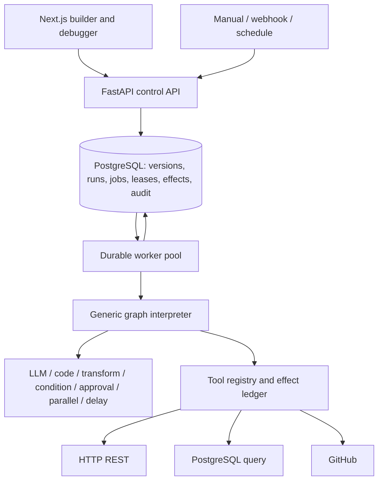

# Workflow Platform Implementation Plan

## Status and purpose

This documentation-only plan evolves AgentOps from three specialized multi-agent
workflows into a durable AI workflow platform. It combines the original detailed
findings 1–13 and concluding recommendations 1–9 into one feature inventory.
**Phases 66–105 are authorized for autonomous implementation as of 2026-09-15.**
Current implementation and validation evidence are in `docs/phase-progress.md`.

Phases 1–65 remain complete. The future sequence is **Phases 66–105**, defined in
[docs/phases.md](docs/phases.md). The former Phase 66 demo script and Phase 67 case
study move to Phases 104 and 105; their deliverables are preserved. Writing this
plan does not implement or complete Phase 66.

Document responsibilities:

- This file owns feature scope, source coverage, and architecture decisions.
- [docs/phases.md](docs/phases.md) owns phase dependencies, scope, and acceptance checks.
- [docs/phase-progress.md](docs/phase-progress.md) owns status and execution evidence.
- [AGENTS.md](AGENTS.md) owns the plan → implement → validate → commit → push → review loop.
- [docs/deferred-phases.md](docs/deferred-phases.md) records adopted backlog items and exclusions.

## Existing foundation to preserve

Keep PostgreSQL-backed workflow runs, agent-step history, structured output
validation, editable human approvals, prompt versions, settings, cost/token/latency
tracking, events, deterministic evaluation, baseline comparisons, demo fixtures,
and existing checks. Extend these capabilities and keep historical data readable.

LLM timeouts/retries, logical cancellation, API-key authentication, and prototype
role checks already exist. They are partial foundations, not durable worker
execution or authenticated tenant-aware permissions.

| Inspected code | Current boundary | Planned change |
| --- | --- | --- |
| `apps/api/src/models/workflow_run.py` | Three business types; nullable organization/user IDs without membership enforcement | Version-bound generic runs and verified ownership |
| `apps/api/src/models/agent_step.py` | AI-specific step records | Generic steps and attempts with optional LLM metadata |
| `apps/api/src/routers/workflow_runs.py` | Business-specific synchronous agent endpoints | Generic asynchronous run/control APIs and compatibility adapters |
| `apps/api/src/services/workflow_state.py` and agent services | Validator exists; several `_set_run_status()` helpers bypass it | One transition authority |
| `apps/api/src/services/workflow_recovery.py` | Cancels database rows without a worker lease | Durable cancellation and stale-result protection |
| `apps/api/src/security.py` and approval router | Caller-supplied role/actor fields; no membership-backed authorization | Verified identity, server-derived actors, and tenant checks |
| `docker-compose.yml`, `apps/api/pyproject.toml` | Local API/web/Postgres setup; no durable worker service | Workers, production packaging, and Kubernetes |

Recheck relevant code during each phase's planning step; this is a planning
baseline rather than a guarantee that every gap will remain unchanged.

## Consolidated feature inventory and source coverage

`D` identifies the original detailed list (1–13); `N` identifies the original
"What I would build next" list (1–9). All 22 original references are mapped below,
including conclusion-only items. Each capability has one specification; phases
divide its delivery into scoped changes.

| ID | Capability | Original sources | Delivery phases |
| --- | --- | --- | --- |
| R01 | Generic definitions, immutable versions, and modeled branching | D1, D10, D11, N1 | 70–71, 74, 82–85 |
| R02 | Generic step records and all eight execution primitives | D1, D2, N1 | 70, 72, 74, 79–82, 86–90 |
| R03 | Centralized, concurrency-safe state transitions | D12 | 66, 72, 76 |
| R04 | Durable jobs, leases, heartbeats, and crash recovery | D4, N2 | 75–76 |
| R05 | Durable cancellation and partial execution history | D5 | 78 |
| R06 | Engine retries, backoff, timeouts, and separate quality retries | D6, N3 | 77, 82, 96 |
| R07 | Run-start and side-effect idempotency | D7, N3 | 73, 86 |
| R08 | Tools/actions, three integrations, and LLM tool use | D8, N4 | 86–90 |
| R09 | Identity, organizations, RBAC, approval authorization, and tenant isolation | D9, N6 | 67–69, 80 |
| R10 | Manual, webhook, and scheduled/cron triggers | N5 | 73, 91–92 |
| R11 | Generic builder, graph debugger, controls, and live operations UI | D1, D11, N7; original capability table and architecture | 93–97 |
| R12 | High-concurrency benchmarks and failure evidence | D4, N8 | 98–99 |
| R13 | Kubernetes deployment and operational verification | N9; original capability table | 100–102 |
| R14 | Accurate platform positioning, architecture docs, demo, and case study | D3, D13 | Every phase's documentation; final consolidation 103–105 |

### R01 — Definitions, versions, and branching

Persist `WorkflowDefinition`, editable drafts, immutable `WorkflowVersion`, typed
nodes/edges, entry point, input/output schemas, bindings, and execution policies.
Each run permanently pins its version. Publishing affects future runs only;
archived versions remain readable by existing runs.

The engine dispatches by step type, never by sales/feedback/incident type.
Conditions select modeled edges through a constrained expression language.
Validate references, reachability, types, branch defaults, fan-in, and retry
bounds before publication. Migrate all three existing workflows and baseline
paths into templates, preserving reviewer gates, human edits, and evaluations.

### R02 — Generic step records and primitives

Use `StepDefinition`, `StepRun`, and separate persisted `StepAttempt` records.
Capture node/version identity, input/output, status, attempt number, logical
iteration/branch identity, start/heartbeat/completion timestamps, error code/message,
idempotency key, and optional model/prompt/token/cost metadata. Non-LLM steps must
not invent agent names or model usage.

| Original primitive | Canonical type | Delivery |
| --- | --- | --- |
| `LLM_STEP` | `llm` | Phase 82 |
| `CODE_STEP` | `code` | Phase 74: registered deterministic handlers |
| `HTTP_TOOL` | `tool` with HTTP adapter | Phases 86–87 |
| `CONDITION` | `condition` | Phase 74 |
| `HUMAN_APPROVAL` | `approval` | Phase 80 |
| `TRANSFORM` | `transform` | Phase 74 |
| `PARALLEL` | `parallel` | Phase 81 |
| `DELAY` | `delay` | Phase 79 |

Keep historical `AgentStep` data through compatibility reads; avoid destructive
renames and fabricated backfills of definitions that never existed.

### R03 — One transition authority

Replace runtime status setters with one validated transition service covering
run, step, attempt, and job state as each entity is introduced. Make state changes,
terminal timestamps, persisted events, and scheduling decisions transactionally
consistent. Reject stale writes and illegal terminal transitions. Demo/import
fixture creation has an explicit tested path separate from live transitions.
Retries never silently reopen a terminal run.

### R04 — Durable execution

Persist a run plus a durable job before returning its ID/status from the API.
Workers claim with leases and fencing tokens, heartbeat during work, and
checkpoint progress in PostgreSQL. Recover expired work after process death.
Duplicate delivery cannot duplicate logical completions or downstream scheduling.
Approvals, delays, and retry backoff release workers instead of sleeping in a request.

### R05 — Durable cancellation

Persist cancellation intent and check it before claims, I/O, result commits, and
downstream scheduling. Abort cancellable I/O where possible, reject stale results,
and retain completed/partial attempts. Cancellation cannot undo a remote action
already accepted by a provider; record uncertain outcomes for reconciliation.

### R06 — Retry and timeout semantics

Persist `max_attempts`, attempt number, retryable error codes, bounded exponential
backoff with jitter, `next_attempt_at`, per-attempt timeout, and overall deadline.
Separate transient infrastructure failures from permanent validation/auth errors.
Exhaustion produces a failed/dead-letter outcome with explicit recovery.

Reviewer quality revisions have a separate bounded counter and feedback history.
Coordinate provider SDK retries with engine retries to prevent unintended
multiplication. Human-requested retries remain auditable and bounded.

### R07 — Idempotency

External starts require scoped keys; manual clients retain their key across
request retries. Atomically bind organization, key, and canonical request
fingerprint: identical requests return the same run; changed requests conflict.
Define retention and expired-key behavior explicitly.

Persist stable logical action keys across worker attempts and recovery. Use an
effect ledger plus provider idempotency or reconciliation. Delivery is at least
once; a local database key alone cannot guarantee exactly-once remote effects.

### R08 — Tools and actions

Define `ToolDefinition` with name, description, input/output schemas,
`credential_ref`, timeout, retry policy, and `side_effecting`; pin its contract
version. Persist linked `ToolExecution` request/result (redacted), status, latency,
attempts, errors, effect identity, and reconciliation metadata.

Implement three integrations, each with contract tests and fixtures:

- HTTP REST: bounded requests/responses, destination policy, and protected credentials.
- PostgreSQL query: parameterized queries over a restricted read-only data connection.
- GitHub: read issues and create an issue in a configured repository.

GitHub is the selected alternative to Slack from the original list. Its create
operation must reconcile ambiguous outcomes before retrying a possible effect.
More SaaS integrations are outside this sequence.

LLM steps may request only declared tools through the same executor, with schema
validation, permissions, call/cost/time budgets, and approval for governed actions.
Persist call IDs and continuation state. Tool output cannot grant permissions.
Live integration checks require later authorized credentials; fixtures do not.

### R09 — Identity, organizations, and permissions

Persist users, organizations, memberships, and server-authoritative roles. Use
verified sessions/tokens and scoped service principals for automations. Never
trust caller-provided role, actor, or organization without identity/membership checks.

Roles are `viewer`, `operator`, `reviewer`, and `admin`: viewers read their
organization; operators draft/start/control permitted workflows; reviewers resolve
approvals; admins manage membership, credentials, settings, and publication.
Only reviewer/admin may approve; only admin may publish/change production workflows
or override high-severity findings. Enforce this in APIs and workers.

Scope runs, nested steps, files, approvals, prompts/settings, tools/credentials,
triggers, evaluations, exports, aggregates, and event streams. Backfill legacy data
into an explicit default organization with a reversible migration strategy.
Audit authenticated actors and sensitive changes. Test forgery, escalation, and
cross-tenant access.

### R10 — Triggers

Manual starts, authenticated webhooks, and cron schedules share the versioned
start/idempotency contract. Webhooks verify signatures, freshness, payload limits,
event IDs, and configured organization/definition binding. Schedules persist
timezone, next fire time, enablement, concurrency policy, and bounded missed-run
behavior; replicas cannot double-fire. Triggers bind an explicit version or the
published version resolved atomically at fire time; retries keep that version.

### R11 — Builder, debugger, and operations

Provide a graph editor with typed nodes, bindings, conditions, tools, retries,
timeouts, approvals, delays, joins, validation, save/load, version history, and
admin publication. Users can construct supported graphs without Python changes.

The debugger shows the run's pinned graph, node input/output, attempts, tool calls,
cost/tokens, latency, logs/errors, approval state, and selected edges. Add
authorized cancellation, safe retry controls, paginated history, and live updates.
Operations views show queued/running/failed/retrying jobs, stale leases, worker
health, queue wait, throughput, and exhaustion.

### R12 — Reliability evidence

Run thousands of cheap deterministic workflows using LLM/network fixtures. Record
throughput, queue/execution latency percentiles, concurrency, resource limits,
retry recovery, duplicate suppression, and expected versus observed effects.
Inject worker crashes, duplicate delivery, timeouts, database interruptions,
cancellation, scheduler races, and approval races. After recovery, assert zero
lost accepted jobs and zero duplicated effects in the controlled idempotent sink.

Publish commands, seed, dataset size, environment, commit, raw results, and limits.
Controlled benchmarks do not guarantee arbitrary third-party behavior or 10,000
simultaneous LLM calls.

### R13 — Kubernetes and operation

Ship production web/API/worker images and Kubernetes resources for web, API,
workers, configuration/secrets references, services/ingress, health/readiness,
resource limits, migrations, persistent Postgres or a managed database, and worker
metrics. Include reproducible local and documented hosted cluster profiles.
Verify restart, rolling update, scaling, persistence, backup/restore, and rollback
with deterministic workflows. Record actual deployment evidence; any hosted
validation requiring credentials remains pending until target/access are supplied.

### R14 — Documentation and positioning

Distinguish implemented from planned capabilities in README, overview,
specification, architecture, agent/observability/deployment docs, backlog, and
progress. Once the implementation supports it, lead with:

> A durable AI workflow platform for building, running, debugging, evaluating,
> and improving business automations with LLM, deterministic, tool, and human-approval steps.

Existing multi-agent workflows and evaluation results remain examples. Explain
version pinning, delivery semantics, retry/cancellation limits, tenant security,
operations, and measured reliability. The demo script and case study use actual
evidence; seeded outputs and aspirational metrics are not live results.

## Architecture and sequencing decisions

These planning defaults make later work executable. Record necessary adjustments
during phase planning, then update dependent phases before implementing.

- Retain Next.js, FastAPI, SQLAlchemy/Alembic, and PostgreSQL. Start with a
  PostgreSQL-backed durable queue so run creation/enqueue share one transaction.
  An external broker is unnecessary for this scope; in-process background tasks
  do not satisfy durability.
- Establish identity and tenant ownership before new resources/integrations.
  Use a verified OIDC-compatible identity boundary and local test fixtures;
  record deployment provider/account configuration before live validation.
- Use additive migrations and explicit legacy adapters. Switch new starts only
  after template parity checks. Legacy agent endpoints must not bypass the engine
  for migrated runs.
- Start with validated acyclic graphs. Model bounded reviewer revisions as an
  explicit policy over a declared subgraph, not arbitrary cycles. Execution keys
  include logical iteration/branch identity.
- `code` uses registered, versioned deterministic handlers. `transform` and
  `condition` use constrained operations; arbitrary uploaded Python and `eval`
  are outside this plan.
- Parallel joins initially require all selected branches to succeed, with
  deterministic output ordering; unselected conditional branches are skipped.
  Delays and approvals are persisted waits.
- Scheduler default: IANA timezone, UTC fire instants, skip nonexistent DST times,
  fire once at the earlier ambiguous instant, coalesce missed ticks into at most
  one catch-up run, and allow one active run per schedule.
- Start live updates with permission-aware polling; a second transport is optional.
- Keep credentials, external account setup, paid traffic, and hosted cluster access
  out of planning. Track missing live checks separately from local passing tests.

## Milestones and completion gate

| Milestone | Phases | Reviewable outcome |
| --- | --- | --- |
| State and security foundations | 66–69 | Transitions, identity, tenant isolation, approval permissions |
| Definitions and execution records | 70–74 | Published graphs and idempotent starts without business-type branching |
| Durable runtime and primitives | 75–82 | Recovery, retries, cancellation, waits, parallelism, LLM execution |
| Existing workflow migration | 83–85 | Sales, feedback, incident, and baselines with parity evidence |
| Integrations and automation | 86–92 | Audited tools/actions plus manual, webhook, and cron starts |
| Authoring and operations UX | 93–97 | Builder, publication, debugger, controls, worker visibility |
| Reliability and deployment | 98–102 | Load/failure results and verified Kubernetes deployment |
| Evidence and storytelling | 103–105 | Accurate README/docs, demo script, and case study |

Every implementation phase follows the loop in `AGENTS.md`: plan, implement,
validate, commit, push, review, fix, and revalidate/recommit/repush/review as needed.
Record commit IDs, push status, checks, review outcome, and blockers in progress.
Do not advance until the current phase passes those gates.

Completion requires implementation and acceptance evidence for every R01–R14.
This revision completes planning only. Notifications, evaluation-result caching,
another evaluator, another business use case, and additional integrations do not
enter scope simply because older aspirational documents mention them.
