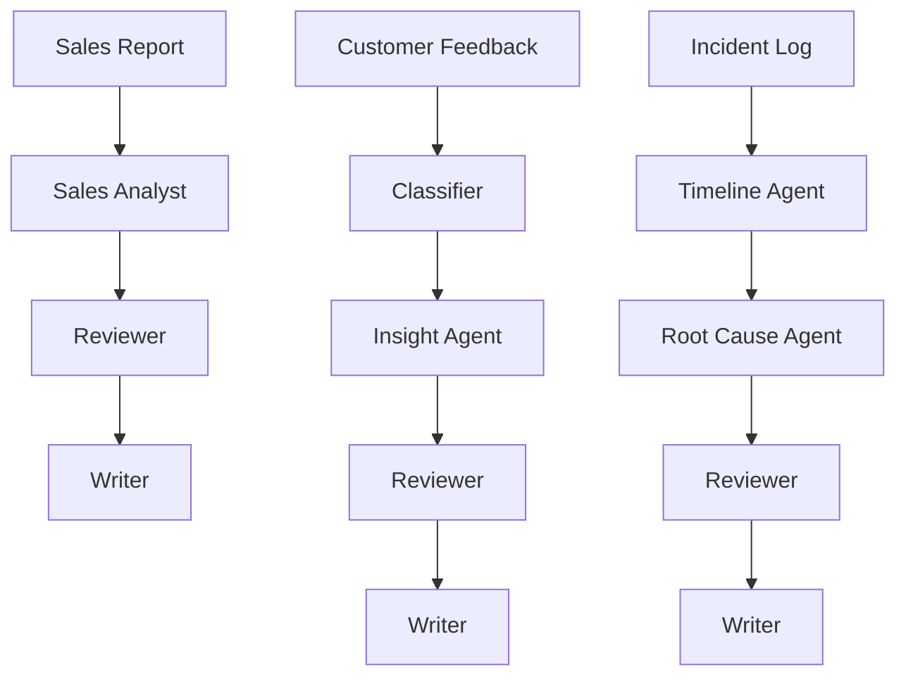

# Agents

AgentOps uses specialized agents for different business workflows. Agent services
store each execution in `agent_steps`, including inputs, outputs, status, model,
tokens, cost, latency, retry count, and error details.

## Agent Types

Agent type values are defined in `apps/api/src/models/agent_type.py`:

| Agent Type | Purpose |
| --- | --- |
| `router` | Detect workflow type from input text |
| `analyst` | Extract sales report findings |
| `classifier` | Categorize customer feedback |
| `insight` | Convert classified feedback into product insights |
| `timeline` | Extract incident timeline events |
| `root_cause` | Analyze confirmed facts, likely causes, unknowns, and actions |
| `reviewer` | Check support, quality, missing items, and retry/approval need |
| `writer` | Produce the final approved business document |

## Workflow-Specific Agent Chains

## Reviewer and Retry Rules

Reviewer outputs drive workflow control:

- High-quality outputs can proceed to writer.
- Low-quality outputs can trigger retry.
- Medium-confidence or high-risk outputs can require human approval.
- Retry exhaustion moves the workflow toward human review instead of continuing
  indefinitely.

The sales reviewer includes the canonical retry rules; customer feedback and
incident reviewers follow the same approval/retry pattern.

## Human Approval Contract

The writer must not run until the workflow has one of these:

- A reviewer-approved analysis.
- An approved human approval record.
- Human-edited structured analysis submitted through the approval UI.

Human edits are stored on `human_approvals.edited_analysis_json` and writer
services prefer the edited analysis when present.

## Runtime Settings

Agent runtime settings are configurable through:

- `agent_settings` table.
- `/agent-settings` API.
- `/settings` UI.

Supported settings include:

- Model.
- Temperature.
- Max tokens.
- Timeout.
- Max retries.
- Active prompt override.
- Reviewer approval threshold.
- Human approval threshold.

## Structured Output Guardrails

Agent outputs are validated with Pydantic schemas. When structured JSON is
invalid, the LLM client can retry with repair instructions. If repair fails, the
step is marked failed and the workflow records a safe failure state.

## Baseline Agent

The baseline path intentionally avoids the reviewer, retry, and human approval
steps. It exists so the app can compare a single-agent output against the
multi-agent workflow on the same input.
