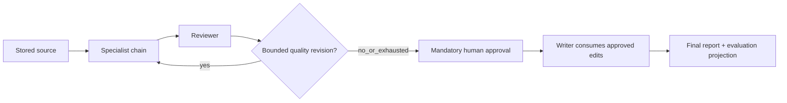

# Agents and business templates

Agents are one kind of workflow step. Generic execution also supports code,
transforms, conditions, approvals, delays, parallel branches and tools; these
steps do not invent agent/model metadata. The [registry](../apps/api/src/services/execution_registry.py)
and [LLM runtime](LLM_EXECUTION.md) define dispatch.

## Business agent roles

| Type | Responsibility |
| --- | --- |
| `router` | Detect sales, feedback or incident input with confidence/fallback |
| `analyst` | Extract sales findings, risks, recommendations and evidence |
| `classifier` | Categorize customer comments |
| `insight` | Derive feedback themes and supporting examples |
| `timeline` | Preserve incident events and timestamps |
| `root_cause` | Separate confirmed facts, inferred causes, unknowns and actions |
| `reviewer` | Check source support, quality, issues and revision need |
| `writer` | Produce a report from the approved structured payload |

Types are defined in [AgentType](../apps/api/src/models/agent_type.py). There is no
additional live evaluator-agent call: final-output scoring uses the deterministic
[evaluation service](../apps/api/src/services/evaluation_metrics.py).

## Published business flow

Sales uses analyst; feedback uses classifier/insight; incident uses timeline/root
cause. Published multi-agent templates allow at most two quality revisions and
still require approval after exhaustion or favorable review. Revisions retain
reviewer/human feedback and earlier iterations. High/critical findings require
administrator override. The one-step baseline omits the review chain.
[Template contracts and rollout](BUSINESS_TEMPLATES.md).

## Approval and handoff contract

Generic approvals bind version, source context and payload hash. Decisions require
the displayed hash and current reviewer/admin authority. Valid edits supersede the
old approval ID; stale IDs cannot authorize replacement content. Writers bind to
the approved output. Side-effecting tools require the exact governed action,
including tool version and arguments. [Approval tests](../apps/api/tests/test_execution_approvals.py).

Legacy unlinked runs retain their older reviewer/approval service rules. Durable
business runs have one canonical owner and atomic AgentStep/approval/cost
projections; old per-agent endpoints reject them. Historical edited analysis
remains readable. [Compatibility](BUSINESS_TEMPLATES.md#compatibility-and-control-ownership).

## Settings, attempts and usage

Publication pins prompt snapshots; acceptance pins model/settings/pricing inputs.
Later settings or prompt-pointer changes affect future starts, not accepted work.
Structured output and business semantic validators apply bounded repair inside
one attempt deadline. Generic SDK retries are disabled; engine retries and quality
iterations have separate bounds and retained histories.

Each returned response contributes observed tokens, latency and estimated cost.
Unknown model cost is null, and lost provider usage is not invented. Tool-calling
LLM nodes also retain private continuation state and enforce declared-tool,
call/round/cost/time budgets. [LLM execution](LLM_EXECUTION.md) ·
[LLM tools](LLM_TOOL_CALLING.md) · [Observability](OBSERVABILITY.md).

## Evidence

[Sales](../apps/api/tests/test_sales_template.py),
[feedback](../apps/api/tests/test_feedback_template.py) and
[incident](../apps/api/tests/test_incident_template.py) tests cover provider
fixtures, edits, retries, cancellation, projections and compatibility. These
validate workflow behavior, not live-provider output equality or a measured
quality improvement. Seeded showcase values are labeled in [evaluation](EVALUATION.md).
