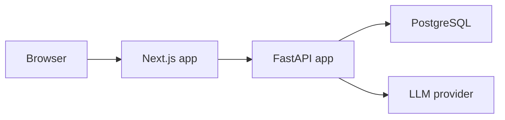
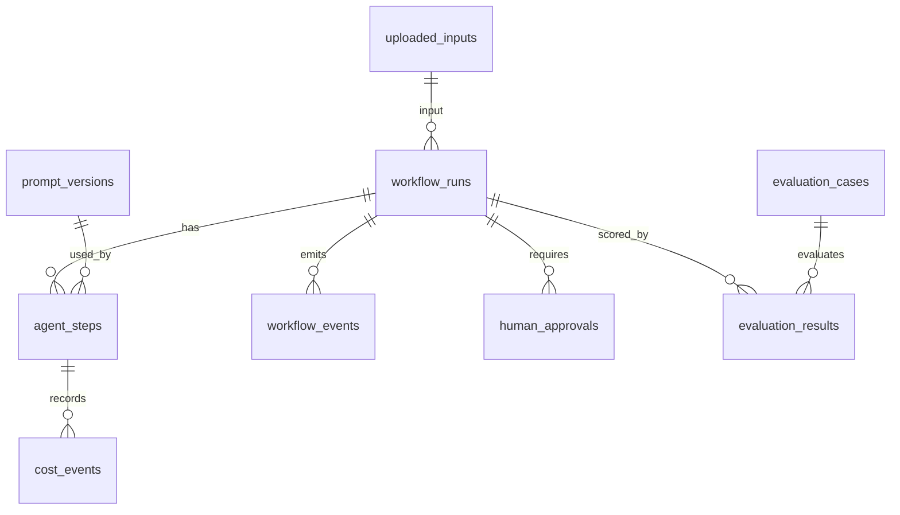

# Architecture

AgentOps is a full-stack workflow application with a FastAPI backend, a Next.js
frontend, and PostgreSQL persistence. The system treats AI generation as a
stateful workflow rather than a one-shot chat request.

## Runtime Components



## Backend Layout

- `apps/api/src/main.py` registers API routers.
- `apps/api/src/routers/` contains HTTP endpoints.
- `apps/api/src/services/` contains workflow, agent, evaluation, cost, and demo logic.
- `apps/api/src/models/` contains SQLAlchemy models.
- `apps/api/src/schemas/` contains Pydantic API contracts.
- `apps/api/tests/` contains unit and API tests with fake sessions where practical.

Primary routers:

- `/workflow-runs`
- `/uploaded-inputs`
- `/human-approvals`
- `/prompt-versions`
- `/agent-settings`
- `/evaluation-results`
- `/agent-performance`
- `/demo`

## Identity boundary (Phase 67)

Verified OIDC tokens and revocable browser sessions resolve users and active
organization memberships in the shared authentication dependency. Roles and
service-principal scopes come from the database. See [identity setup](IDENTITY.md)
for PKCE sign-in, session expiry, provisioning and fixture validation. Public
API startup is blocked until the tenant isolation/RBAC gate in Phases 68–69;
identity alone does not isolate historical business data.

## Frontend Layout

- `apps/web/src/app/` contains Next.js route segments.
- `apps/web/src/lib/api.ts` is the server-side API client.
- `apps/web/src/lib/types.ts` mirrors backend API response contracts.
- `apps/web/src/components/` contains shared UI components.
- `apps/web/tests/routes.smoke.test.mjs` protects route/API wiring.

Primary dashboard routes:

- `/workflow-runs`
- `/workflow-runs/new`
- `/workflow-runs/:id`
- `/human-approvals`
- `/evaluation`
- `/workflow-comparison`
- `/costs`
- `/agent-performance`
- `/failures`
- `/improvements`
- `/prompt-versions`
- `/settings`
- `/demo`

## Core Data Model



Important tables:

- `uploaded_inputs`: pasted/uploaded source text and file metadata.
- `workflow_runs`: workflow type, run mode, status, final output, cost, latency.
- `agent_steps`: agent inputs, outputs, model metadata, cost, latency, failures.
- `workflow_events`: audit-style lifecycle events.
- `human_approvals`: approval decisions, feedback, edited analysis.
- `prompt_versions`: versioned prompt templates by agent type.
- `agent_settings`: runtime model and threshold settings.
- `evaluation_cases`: gold-standard expectations.
- `evaluation_results`: baseline and multi-agent scores.

## Workflow State Model

Workflow statuses are defined in `WorkflowStatus`:

```text
created
running
routing
analyst_running
reviewer_running
retrying
waiting_for_human
writer_running
completed
failed
cancelled
```

`services/workflow_state.py` owns live run and agent-step transitions. Terminal
states cannot reopen, and terminal timestamps are set with the transition.
`services/workflow_transactions.py` owns short transactions: a PostgreSQL row
lock serializes each run's mutations and a persisted `state_revision` rejects
stale operations (HTTP 409). Step starts and their events commit together;
results, costs, totals, decisions, events, and resulting run states commit together.
Nested helpers flush; only the outer owner commits. Rollback removes all changes
and suppresses external completion telemetry.

Provider calls happen between transactions without a run lock. Results must
present the revision captured at start, so cancellation or another control
operation fences late success and failure. This is logical cancellation; it does
not interrupt a provider request or recover work after process death. Durable
worker cancellation remains Phase 78. Revision migration `f066_state_revision`
adds a zero-initialized counter without modifying historical outputs.

Demo imports are an explicit exception: `services/demo_dataset.py` constructs
historical completed fixtures in its own transaction without inventing live
transition events. Its run/step assignments and evaluation-result bookkeeping
are the documented direct-write exceptions. Live evaluations call the same agent
services and approval transitions as interactive workflows.

`tests/test_workflow_transactions_postgres.py` uses isolated PostgreSQL schemas
and independent sessions to verify rollback, stale writes, conflicting decisions,
cancellation/completion races, and late provider results for all three baselines.
Set `WORKFLOW_TEST_DATABASE_URL` to a disposable database to run these tests;
CI supplies PostgreSQL and also runs the complete migration chain.

The current architecture is the business-workflow foundation. The
[platform implementation plan](../WORKFLOW_PLATFORM_IMPLEMENTATION_PLAN.md)
defines the future generic graph, versions, step attempts, workers, tools,
triggers, tenant permissions, and Kubernetes architecture. These remain planned.

## Agent Execution Pattern

Agent services follow the same broad shape:

1. Validate the workflow run and required prior steps.
2. Create an `AgentStep` with `running` status.
3. Log `agent_started`.
4. Resolve runtime prompt/model settings.
5. Call the LLM client or deterministic demo path.
6. Validate structured output.
7. Persist output, token usage, cost, latency, and status.
8. Log completion or failure.
9. Transition the workflow when needed.

## Demo Data Path

Phase 57 and 58 added deterministic demo data:

- `services/demo_dataset.py` seeds demo uploaded inputs, baseline runs,
  multi-agent runs, evaluation results, and agent steps.
- `routers/demo.py` exposes one-click demo seeding endpoints.
- `apps/web/src/app/demo/` exposes demo controls in the UI.

The demo path is idempotent and does not require live LLM credentials.
