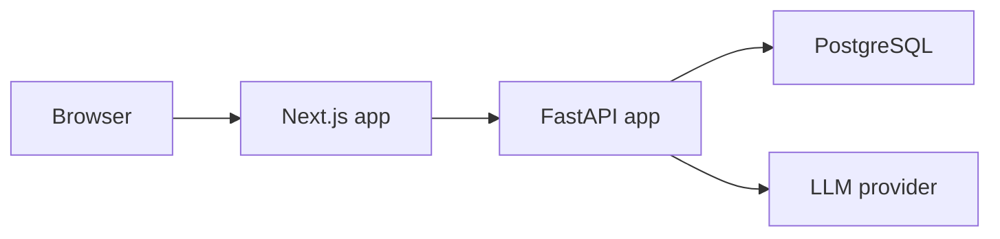
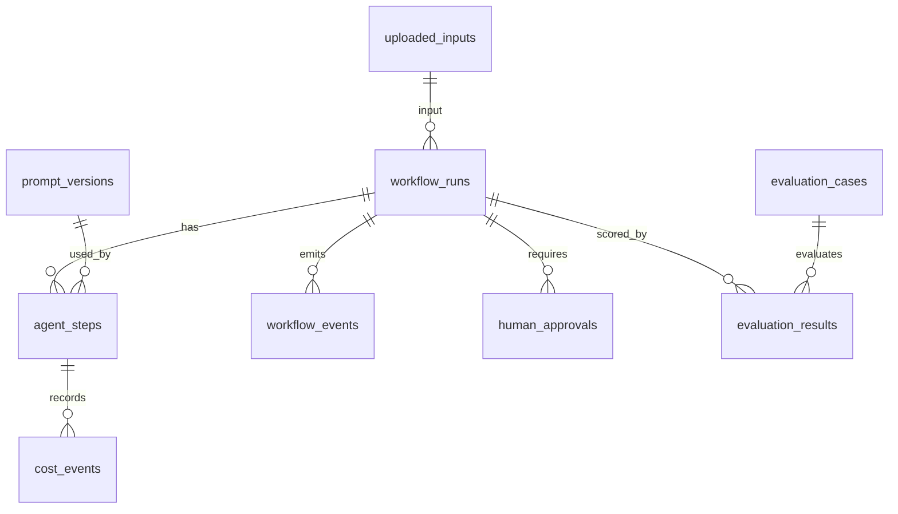

# Architecture

AgentOps is a full-stack workflow application with a FastAPI backend, a Next.js
frontend, and PostgreSQL persistence. The system treats AI generation as a
stateful workflow rather than a one-shot chat request.

## Runtime Components



## Backend Layout

- `apps/api/src/main.py` registers API routers.
- `apps/api/src/routers/` contains HTTP endpoints.
- `apps/api/src/services/` contains workflow, agent, evaluation, cost, and demo logic.
- `apps/api/src/models/` contains SQLAlchemy models.
- `apps/api/src/schemas/` contains Pydantic API contracts.
- `apps/api/tests/` contains unit and API tests with fake sessions where practical.

Primary routers:

- `/workflow-runs`
- `/uploaded-inputs`
- `/human-approvals`
- `/prompt-versions`
- `/agent-settings`
- `/evaluation-results`
- `/agent-performance`
- `/demo`

## Frontend Layout

- `apps/web/src/app/` contains Next.js route segments.
- `apps/web/src/lib/api.ts` is the server-side API client.
- `apps/web/src/lib/types.ts` mirrors backend API response contracts.
- `apps/web/src/components/` contains shared UI components.
- `apps/web/tests/routes.smoke.test.mjs` protects route/API wiring.

Primary dashboard routes:

- `/workflow-runs`
- `/workflow-runs/new`
- `/workflow-runs/:id`
- `/human-approvals`
- `/evaluation`
- `/workflow-comparison`
- `/costs`
- `/agent-performance`
- `/failures`
- `/improvements`
- `/prompt-versions`
- `/settings`
- `/demo`

## Core Data Model



Important tables:

- `uploaded_inputs`: pasted/uploaded source text and file metadata.
- `workflow_runs`: workflow type, run mode, status, final output, cost, latency.
- `agent_steps`: agent inputs, outputs, model metadata, cost, latency, failures.
- `workflow_events`: audit-style lifecycle events.
- `human_approvals`: approval decisions, feedback, edited analysis.
- `prompt_versions`: versioned prompt templates by agent type.
- `agent_settings`: runtime model and threshold settings.
- `evaluation_cases`: gold-standard expectations.
- `evaluation_results`: baseline and multi-agent scores.

## Workflow State Model

Workflow statuses are defined in `WorkflowStatus`:

```text
created
running
routing
analyst_running
reviewer_running
retrying
waiting_for_human
writer_running
completed
failed
cancelled
```

State transitions are centralized through `services/workflow_state.py` and
workflow cancellation is handled through `services/workflow_recovery.py`.

## Agent Execution Pattern

Agent services follow the same broad shape:

1. Validate the workflow run and required prior steps.
2. Create an `AgentStep` with `running` status.
3. Log `agent_started`.
4. Resolve runtime prompt/model settings.
5. Call the LLM client or deterministic demo path.
6. Validate structured output.
7. Persist output, token usage, cost, latency, and status.
8. Log completion or failure.
9. Transition the workflow when needed.

## Demo Data Path

Phase 57 and 58 added deterministic demo data:

- `services/demo_dataset.py` seeds demo uploaded inputs, baseline runs,
  multi-agent runs, evaluation results, and agent steps.
- `routers/demo.py` exposes one-click demo seeding endpoints.
- `apps/web/src/app/demo/` exposes demo controls in the UI.

The demo path is idempotent and does not require live LLM credentials.
