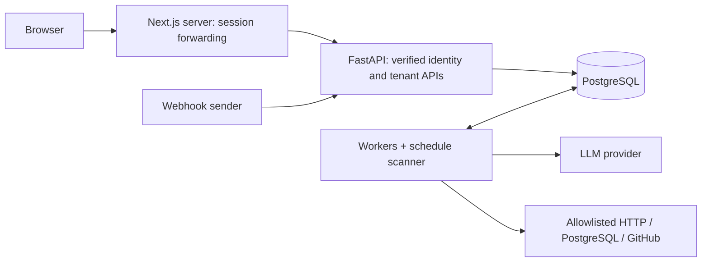
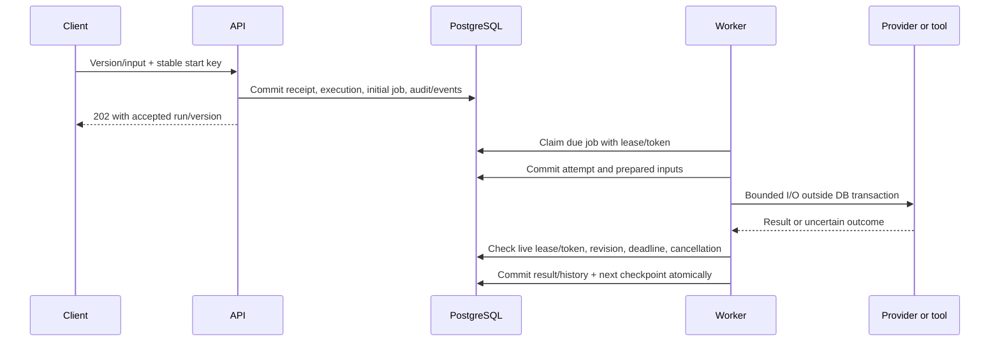
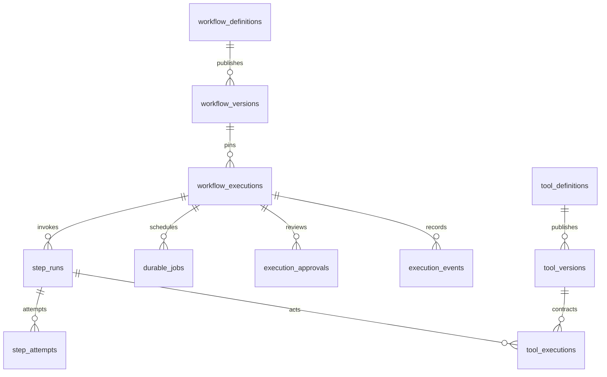

# Architecture

AgentOps separates authoring/admission from execution. PostgreSQL is the durable
source for graph versions, accepted runs, jobs, decisions and history. FastAPI
serves authenticated APIs; Next.js provides the authoring, review and operations
UI; independent Python workers execute bounded checkpoints. See the
[requirement evidence index](PLATFORM_EVIDENCE.md) for code and tests.

## Runtime and trust boundaries

Workers scan due jobs/schedules as trusted infrastructure, then bind a fresh
session to the claimed organization. Public APIs cannot select an arbitrary
infrastructure scope. Provider I/O occurs outside workflow database locks.
Tool credentials resolve only on workers; API catalog references are metadata.
See [identity](IDENTITY.md), [tools](TOOL_CONTRACTS.md) and
[deployment](DEPLOYMENT.md).

## Authoring and version pinning

[WorkflowGraph](../apps/api/src/schemas/workflow_graph.py) defines eight primitives:
`llm`, `code`, `tool`, `condition`, `approval`, `transform`, `parallel`, `delay`.
Schemas are a closed JSON subset; bindings use constrained expressions. Code
nodes reference server-registered handlers, not uploaded Python. Validation checks
reachability, references, routing/defaults, exclusive merges, parallel regions,
policies and executable capabilities. Arbitrary cycles are forbidden; quality
revision regions are explicitly bounded.

Draft saves use a revision check. Publication retains the graph, prompt snapshots
and immutable version. Acceptance pins the chosen version and runtime settings;
retries and approval resume do not reread mutable configuration. Publishing or
archiving later versions does not change existing run history. Tool versions and
server-policy fingerprints are also pinned and rechecked at dispatch. See
[graph/version APIs](WORKFLOW_GRAPH.md), [builder](WORKFLOW_BUILDER.md) and
[LLM configuration](LLM_EXECUTION.md).

## Admission, ownership and completion

The start receipt binds organization, key and canonical request fingerprint.
Identical retries return the original run; changed input with the same key
conflicts. Receipts remain for retained execution history, with no purge/reuse API.
Manual UI keys survive request retries in page memory, not browser reloads.
[Start contract](EXECUTION_RECORDS.md#idempotent-starts-phase-73).

Claims use `FOR UPDATE SKIP LOCKED`. Heartbeats renew a live lease; expiry allows
bounded recovery with a new fence. Completion checks the current job token,
attempt and run revision. A stale worker cannot adopt newer ownership or reopen
terminal history. `workflow_state.py` and transaction authorities centralize live
state changes; events, scheduling and outputs commit together. Demo imports have
an explicit synthetic-history path. [Queue contract](DURABLE_QUEUE.md).

Parallel branches receive independent runnable jobs; a join waits for all selected
branches and finalizes once. Approval/delay/backoff waits retain durable state and
release slots. Generic run states are `pending`, `running`, `waiting`, `retrying`,
`completed`, `failed`, `cancelled`; steps and attempts have their own status sets.
These differ from the retained business-specific labels.
[Execution models](../apps/api/src/models/workflow_execution.py).

## Retries, cancellation and external effects

Infrastructure attempts use the pinned error allowlist, attempt bound, persisted
exponential backoff/jitter and deadlines. Permanent schema/auth/policy failures
are not transient retries. Provider SDK retries are disabled in generic execution;
bounded schema repair shares an attempt deadline and retains returned usage.
Reviewer quality revisions use separate logical iterations and feedback history.
[Retry policy](RETRIES_AND_DEADLINES.md) · [LLM policy](LLM_EXECUTION.md).

Cancellation persists intent, stops new runnable work, attempts cooperative I/O
abort and fences late commits. A synchronous handler may continue until return
while retaining its physical slot. Cancellation cannot undo a provider-accepted
request. Failed/cancelled runs can create one linked recovery child, subject to
current authority and policy. Source history stays terminal; approvals are fresh,
reused checkpoints have provenance, and spent effect/quality budgets remain.
[Recovery controls](WORKFLOW_RECOVERY.md).

The effect ledger reserves a stable logical action key before dispatch. HTTP
replay requires configured provider idempotency; GitHub creation uses persisted
correlation and bounded reconciliation, never an assumed safe duplicate POST.
Restricted PostgreSQL tools are read-only. Missing proof after an ambiguous write
leaves `unknown`, blocking unsafe recovery until an authorized evidence-backed
resolution. LLM tool calls use the same executor with declared bindings, exact
write approval and call/round/cost/time budgets. Delivery is at least once; the
local ledger alone cannot promise exactly-once remote effects.
[Tool contracts](TOOL_CONTRACTS.md) · [LLM tools](LLM_TOOL_CALLING.md).

## Persistent model and compatibility

The diagram shows logical relationships; tenant-qualified foreign keys and
identity/immutability guards enforce database boundaries. Users, organizations,
memberships, sessions, service principals, triggers and recovery receipts provide
identity/admission/control records. Model definitions live in
[models](../apps/api/src/models); migrations in [Alembic versions](../apps/api/alembic/versions).

Sales, feedback and incident starts use published templates by default. A unique
`legacy_run_id` links each business run to at most one durable owner. The worker
updates business run, AgentStep, approval, event and cost projections atomically.
Generic attempts and those projections describe the same work: never sum both.
Legacy per-agent endpoints reject durable-owned runs. Historical AgentStep-only
runs remain readable without fabricated graph versions or attempts.
[Business compatibility/backout](BUSINESS_TEMPLATES.md).

Migrations are additive where required. Guards refuse downgrades that would erase
retained histories or live ownership. Feature flags select legacy starts only for
future business runs; accepted durable work keeps its worker and pinned version.
Image rollback requires a compatible schema. Phase 102 verified metadata-only
image rollback and a fresh-database restore, not a destructive schema downgrade.

## User-facing and operational surfaces

- `/workflow-definitions`: drafts, validation, versions, diffs and manual starts.
- `/execution-traces`: pinned graph, paginated steps/attempts/events/tools/approvals.
- `/workflow-triggers`: webhook/cron configuration and retained delivery histories.
- `/operations`: organization-scoped queue and worker observations.
- Business runs, approvals, final outputs, evaluation/comparison, cost, prompts,
  settings and membership pages retain their existing roles.

Readers return bounded metadata/detail previews with redaction. Small authorized
pulses refresh changed pages; hidden/offline tabs pause and failures back off.
Worker presence is observation, never lease authority. Aggregate infrastructure
metrics use a separate trusted CLI/CronJob. [Observability](OBSERVABILITY.md).

## Validation boundary

PostgreSQL concurrency/migration tests, deterministic adapter/provider fixtures,
[10,000-run measurements](BENCHMARK_RESULTS.md),
[injected faults](RELIABILITY_RESULTS.md) and
[deployed operations](KUBERNETES_OPERATIONS_RESULTS.md) cover different layers.
Synthetic evaluation records are not model-quality measurements. Hosted
availability, real third-party acceptance and production security certification
remain outside the recorded checks.
