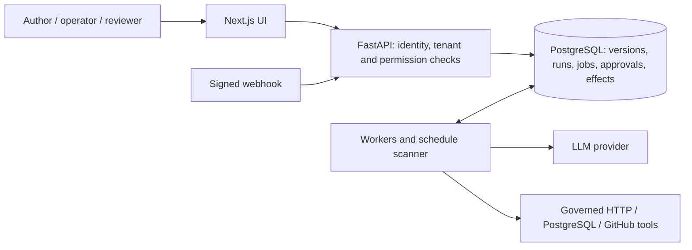

# AgentOps: from agent chains to a durable workflow platform

## Outcome at a glance

AgentOps combines typed workflow authoring, durable execution and inspectable
human decisions. Sales, customer feedback and incident analysis run as published
templates on the same engine as general tool and approval workflows.

The delivered scope covers **R01–R14 and Phases 66–105**. The
[delivery ledger](phase-progress.md) records each phase's implementation, fixes,
validation, pushed commits and CI; it governs completion status. This case study
summarizes the engineering evidence, including its limits.

| Evidence class | Recorded result | What it establishes |
| --- | --- | --- |
| Measured load | 10,000 completed workflows; 33,333 completed jobs; 3,333 intended sink effects | Accounting and throughput for a controlled local workload |
| Measured faults | 45 passing experiment cases; all 72 accepted identities accounted for | Expected completion, failure and cancellation under injected faults |
| Deployed operations | 21 completed workflows and 21 effects from 23 requests | Recovery, scaling and compatible release procedures in single-node kind |
| UI rehearsal | Published graph, durable retry, skipped branch, human edit and final output | Actual local UI/API behavior with synthetic model responses |
| Assigned evaluation | Baseline/multi-agent score, cost and latency examples | How comparisons expose tradeoffs; no measured model-quality uplift |

Sources: [load results](BENCHMARK_RESULTS.md), [fault results](RELIABILITY_RESULTS.md),
[operations results](KUBERNETES_OPERATIONS_RESULTS.md),
[rehearsal records](evidence/phase104/summary.json), [evaluation](EVALUATION.md).

## Problem and goal

A business automation must retain more than an answer. A reviewer needs to know
which source supported a recommendation and which exact payload they approved.
An operator needs to know whether a timed-out write happened, whether another
worker already owns a job, and which version will resume after a restart.

The original application supplied three structured multi-agent pipelines,
approvals and evaluation dashboards. The expansion made execution independent
of those business types while preserving their history and user-facing flows.
The goal was a platform where accepted work, ownership, decisions and uncertain
outcomes remain visible and recoverable. The [planning baseline](../WORKFLOW_PLATFORM_IMPLEMENTATION_PLAN.md#historical-planning-baseline--2026-09-14)
records the original gaps; the [current specification](PROJECT_SPEC.md) defines
the resulting contract.

## Architecture and the decisions behind it

The diagram separates request admission, durable state and external execution.
Workers claim globally as trusted infrastructure, then bind execution to the
claimed organization. Tool credentials resolve on workers. The detailed
[architecture](ARCHITECTURE.md) links schemas, transactions and the runtime.

### One durable authority for accepted work

Admission commits the version-bound execution, start receipt, initial job and
audit/events before returning HTTP 202. An organization-scoped idempotency key
returns the original execution for an identical retry and rejects changed input.
This makes a lost HTTP response recoverable without creating a second logical run.
[Start contract](EXECUTION_RECORDS.md#idempotent-starts-phase-73).

PostgreSQL also holds the queue. Workers claim due rows with leases and ownership
tokens, perform provider I/O outside database locks, then recheck ownership,
revision, deadlines and cancellation before committing. Output, history and the
next checkpoint commit together. Expired ownership can be recovered within
configured bounds; a stale worker cannot commit over its replacement.
[Queue and fencing](DURABLE_QUEUE.md).

Using PostgreSQL keeps admission and scheduling in one transaction and avoids a
second broker consistency boundary. It also places queue contention and history
storage on the database. The measured benchmark quantifies one local workload;
it does not establish a universal production capacity limit.

### Immutable contracts with bounded execution

Drafts use revision checks; publication creates immutable versions. Runs pin
versions and runtime configuration so later prompt, tool or draft edits cannot
silently change accepted work. Eight primitives cover `llm`, `code`, `tool`,
`condition`, `approval`, `transform`, `parallel` and `delay`.
[Graph contract](WORKFLOW_GRAPH.md) · [builder](WORKFLOW_BUILDER.md).

Graphs are acyclic except for explicitly bounded quality-revision regions.
Code nodes reference registered handlers; conditions and transforms use constrained
expressions. This trades unrestricted programmability for validation and controlled
execution. Parallel branches join once after all selected branches succeed.
Approval, delay and retry waits persist their due/decision state and release
worker capacity. [LLM execution](LLM_EXECUTION.md) · [retry policy](RETRIES_AND_DEADLINES.md).

### Effects and approvals remain explicit

External delivery is at least once. A local transaction cannot prove what a
remote service did after a connection failed. Tool execution reserves a stable
logical effect key and uses provider-specific idempotency or reconciliation.
Without sufficient evidence, an ambiguous write remains `unknown` and cannot be
blindly replayed. Cancellation stops future work and fences late results; it
cannot reverse an accepted remote action. [Tool contracts](TOOL_CONTRACTS.md).

Approvals bind an exact payload snapshot. A human edit supersedes the old decision
request and requires a replacement approval. Permissions are rechecked when the
decision commits. Failed/cancelled runs remain terminal; explicit recovery creates
a linked child with retained checkpoint/effect provenance and fresh required
approvals. [Approval/runtime source](../apps/api/src/services/approval_runtime.py) ·
[recovery controls](WORKFLOW_RECOVERY.md).

### Security is part of the state model

Verified OIDC identity and active organization memberships determine roles.
Viewers read; operators draft/start/control; reviewers decide approvals;
administrators publish and manage configuration, membership and effect resolution.
Service principals also need explicit action scopes. Caller-supplied actor, role
or organization fields cannot grant authority. Tenant checks cover nested reads,
exports, aggregates, tools, triggers and traces. [Identity](IDENTITY.md) ·
[permission tests](../apps/api/tests/test_permissions_audit.py).

HTTP destinations and methods are configured; PostgreSQL tools use registered
parameterized read-only queries; GitHub tools operate on configured issue
repositories. Declared LLM tool calls use the same approval/effect executor and
bounded call, round, cost and time budgets. These integration contracts have
fixture coverage; live account acceptance is separately unperformed.
[HTTP](HTTP_TOOL.md) · [PostgreSQL](POSTGRESQL_TOOL.md) · [GitHub](GITHUB_TOOL.md) ·
[LLM tools](LLM_TOOL_CALLING.md).

## Business workflows and the product experience

| Workflow | Specialist work | Review and output |
| --- | --- | --- |
| Sales | Analyst extracts revenue, pipeline, risks and recommendations | Reviewer checks evidence; human approves/edits; writer produces an executive report |
| Customer feedback | Classifier groups comments; insight agent identifies themes and examples | Reviewer checks source support; human approves/edits; writer produces product insights |
| Incident | Timeline agent orders events; root-cause agent separates facts, inferences and unknowns | Reviewer challenges causal claims; human approves/edits; writer produces an incident report |

Each has a one-step baseline and a published multi-agent template. Quality
revisions retain prior feedback independently of infrastructure retry attempts.
Historical AgentStep-only records stay readable; new durable runs have one
canonical execution owner and atomic business projections. Legacy controls
cannot also execute a migrated run. [Templates and compatibility](BUSINESS_TEMPLATES.md).

The builder provides typed forms, validation, publication, version history/diffs
and idempotent starts. The debugger shows the pinned graph, selected edges,
steps, attempts, tools, approvals and wait reasons. Operations exposes scoped
queue and worker observations. Existing approval, output, comparison, evaluation,
cost and prompt/settings views remain available.
[Debugger](WORKFLOW_DEBUGGER.md) · [operations](WORKER_OPERATIONS.md).

### A concrete rehearsed path

The [five-minute script](DEMO_SCRIPT.md) uses an isolated local database and an
optional synthetic provider. Its condition/approval/HTTP graph was published and
started through the actual UI. The true path waited for an API approval and
retained a failed HTTP attempt followed by success **5.134355 seconds** later.
The false path completed while skipping the approval and tool. The generic
approval scene uses the API because the debugger has no decision form.

A separate sales run used the business approval UI. **Save Edits** created a
replacement approval; **Approve** released the writer. The final report retained
the exact recommendation: **“Assign renewal review to account owners.”** All
three executions completed. The model responses and zero token usage were
synthetic; the database, queue, approval transitions and browser actions were
real local execution. [Reproducible walkthrough](demo-walkthrough.md) ·
[retained observations](evidence/phase104/summary.json).

## Evaluation: expose tradeoffs without inventing a win

The evaluation corpus has ten cases for each business workflow. Demo seeding adds
two sales showcases, producing **32 cases, 65 historical runs/results and 99
AgentStep records**. The seed assigns comparison outputs and metrics. Those
records demonstrate the UI, not 65 measured provider executions.
[Seed source](../apps/api/src/services/demo_dataset.py) · [seed tests](../apps/api/tests/test_demo_dataset.py).

For actual evaluations, deterministic scoring compares final output with expected
facts, recommendations, risks, themes and timeline items. Normalized keyword and
numeric checks are useful repeatable proxies; they can miss paraphrases or accept
coincidental overlap. The field called factual accuracy measures expected-fact
coverage, not a semantic audit of every claim. No additional LLM judge runs.
[Evidenced methodology](EVALUATION.md).

### Assigned base-case values, not live results

These constants apply to the 30 base-case pairs, not overall averages including
the separate showcases. USD values are assigned examples, not provider invoices.

| Assigned metric | Baseline | Multi-agent |
| --- | ---: | ---: |
| Factual accuracy | 0.70 | 0.92 |
| Unsupported claim rate | 0.22 | 0.05 |
| Completeness | 0.64 | 0.88 |
| Cost, USD | 0.035 | 0.128 |
| Latency, seconds | 4.2 | 18.4 |

The **Remediation impact showcase** deliberately preserves a mixed outcome:

| Assigned metric | Baseline | Previous multi-agent | Corrected multi-agent |
| --- | ---: | ---: | ---: |
| Factual accuracy | 0.94 | 1.00 | 0.94 |
| Unsupported claim rate | 0.00 | 0.00 | 0.33 |
| Completeness | 0.91 | 1.00 | 0.96 |
| Cost, USD | 0.00034 | 0.00205 | 0.00198 |
| Latency, seconds | 2.42 | 10.23 | 7.93 |

Its reviewer issue count falls from one to zero while the assigned unsupported
score worsens. Review approval and deterministic coverage answer different
questions. No uplift percentage is inferred from either table.
[Table provenance and interpretation](EVALUATION.md#assigned-demo-values--not-measured-provider-results).

A live paired comparison should retain the same inputs, selected cases, pinned
prompts/model settings, raw outputs, failed/pending cases and scoring limits.
Evaluation auto-approval records an administrator policy and explicitly states
that no individual human review occurred. Unknown provider usage/cost remains
unknown; an abandoned request may have unreturned spend. The delivery did not
perform a paid-provider comparative quality experiment.

## Measured reliability and capacity

### Controlled load

The [benchmark](BENCHMARK_RESULTS.md) completed all **10,000 accepted workflows**,
**33,333 jobs** and **26,666 attempts**, reconciling **3,333 intended sink effects**.
All **1,000 duplicate start requests** returned their original run IDs. There
were no lost jobs, duplicate effects, unknown effects or failed workflows.

| Concurrent slots in one worker loop | Completed workflows | Workflows/second | End-to-end p95, seconds |
| --- | ---: | ---: | ---: |
| 1 | 3,334 | 1.351 | 73.695 |
| 4 | 3,333 | 4.240 | 20.898 |
| 16 | 3,333 | 5.666 | 14.398 |

This was one sequential service-level experiment on a shared Windows/Ryzen host
with PostgreSQL in Docker. Producer, worker threads, synthetic approver and local
sink shared one Python process; inputs were at most 130 bytes. It excludes
HTTP/OIDC admission load, browser load, paid models and human decision time.
The diminishing gain from four to sixteen slots warrants investigation; this
experiment does not isolate its cause. [Method and reproduction](BENCHMARK.md).

### Injected failures

The [fault suite](RELIABILITY_RESULTS.md) ran 15 scenarios three times: **45
passing cases** accounting for **72 accepted workflows**, comprising **54
completed, nine expected failed and nine cancelled**. It retained 279 jobs and
234 attempts. Eighteen sink requests produced 12 intended effects; six duplicate
requests were suppressed. Three deliberately ambiguous writes stayed `unknown`.

Scenarios covered process death, expired claims, duplicate delivery, parallel
joins, approval/cancel races, scheduler races, graceful replacement, database
outage and uncertain remote writes. All accepted work remained accounted for;
expected failure/cancellation is not a claim that every workflow succeeded.
Database recovery required a restarted worker under a supervisor. A separate
15-case fix validation passed after the fixture waited for the actual persisted
lease deadline instead of assuming restart duration. Original measurements
remain intact. [Fault method](RELIABILITY_EXPERIMENTS.md).

## Deployment and operations evidence

[Production container acceptance](PRODUCTION_CONTAINER_RESULTS.md) verified
synthetic OIDC/PKCE over TLS, secure sessions, negative access checks, version and
approval retention, readiness, restarts and SIGTERM. The principal suite and two
separate active-drain checks account for **11 runs and 207 completed jobs**.
Application containers ran non-root with read-only filesystems, dropped
capabilities and explicit resource bounds. These are observed configurations and
local checks, not a public security certification.

[Local Kubernetes acceptance](KUBERNETES_RESULTS.md) verified authenticated
server-rendered access, migration ordering, approval output and retained history
across database/API/worker Pod replacement. The [operations suite](KUBERNETES_OPERATIONS_RESULTS.md)
then reconciled **21 completed workflows and 21 effects from 23 requests**:

- Rolling API/worker update with six active workflows; 19 sampled API/web pairs
  returned 200/200. Sampling does not establish continuous availability.
- Three-worker scaling with nine workflows, then return to one worker.
- Active Pod loss and paused stale ownership; a replacement completed work and
  the resumed stale owner could not change completed history.
- Database loss returned readiness 503 while liveness stayed 200; retained work
  completed after recovery, with worker exceptions/restarts recorded.
- A fresh-database restore matched all 11 selected history/definition/tool tables.
  Replacing the controlled sink Pod preserved its receipts on a PVC.
- Compatible image rollback completed a further approved write.

The release changed packaging metadata only, retaining the same application and
schema. The result verifies the procedure, not an application/schema upgrade.
The cluster was single-node kind; hosted rollout, multi-node/managed-database
failover, Secret/cluster-role recovery and destructive schema rollback were not
performed. [Deployment runbook](KUBERNETES.md) · [operations runbook](KUBERNETES_OPERATIONS.md).

## Lessons and tradeoffs

1. **Define ownership before adding retries.** A token and persisted deadline make
   replacement observable; a timeout alone does not prevent an old process from
   committing. The stale-owner and database-outage experiments test this boundary.
2. **Retain uncertainty.** Recording an unknown remote result is more accurate
   than inventing success or resending an unprotected write. Resolution needs
   evidence, and recovery must preserve spent budgets and earlier approvals.
3. **Test the observation boundary.** A queued-work SIGTERM test did not prove an
   active checkpoint drained, so separate active-lease checks were added. A fast
   Linux database restart exposed a fixture timing assumption; the fix waited for
   the persisted lease deadline without changing runtime safety rules.
4. **Preserve failed evidence.** Earlier Kubernetes harness attempts rejected a
   valid reconciled status or outlived the synthetic identity session. Their failed
   records and completed workflow histories remain; corrected checks used normal
   sign-in renewal without weakening expiry. [Recorded failures](KUBERNETES_OPERATIONS_RESULTS.md#failed-harness-attempts-retained).
5. **Keep examples isolated.** Demo review found connection-query overrides and
   global-worker/tenant-preflight mismatch. Separate fixes reject query options
   and additional organizations; the walkthrough requires an exclusively owned
   database. [Fixture review](evidence/phase104/tenant-guard-review.json).
6. **Keep quality and execution evidence separate.** Durable completion does not
   establish a good recommendation, and a reviewer score does not establish source
   truth. Raw outputs, deterministic checks, approval policy and usage limits
   belong beside each comparison.

## R01–R14 delivery checklist

Each row is implemented with the evidence class and boundaries stated above.
The [full source/test matrix](PLATFORM_EVIDENCE.md) and [phase ledger](phase-progress.md)
provide the detailed acceptance and commit/CI review trail.

| Requirement | Delivered evidence |
| --- | --- |
| R01 | [Immutable definitions, versions and branching](WORKFLOW_GRAPH.md) |
| R02 | [Generic records](EXECUTION_RECORDS.md) and [eight registered primitives](../apps/api/src/services/execution_registry.py) |
| R03 | [Centralized state/transaction authority and PostgreSQL races](../apps/api/tests/test_workflow_transactions_postgres.py) |
| R04 | [Durable jobs, leases, heartbeats and recovery](DURABLE_QUEUE.md) |
| R05 | [Cancellation and retained partial history](WORKFLOW_RECOVERY.md) |
| R06 | [Infrastructure retries/deadlines](RETRIES_AND_DEADLINES.md) and [bounded quality revisions](LLM_EXECUTION.md) |
| R07 | [Start idempotency](EXECUTION_RECORDS.md#idempotent-starts-phase-73) and [governed effects](TOOL_CONTRACTS.md) |
| R08 | [HTTP](HTTP_TOOL.md), [PostgreSQL](POSTGRESQL_TOOL.md), [GitHub](GITHUB_TOOL.md), [declared LLM tools](LLM_TOOL_CALLING.md) |
| R09 | [Identity, organizations, roles, scopes and approval authority](IDENTITY.md) |
| R10 | [Manual starts](WORKFLOW_BUILDER.md), [signed webhooks](WEBHOOK_TRIGGERS.md), [cron](SCHEDULED_TRIGGERS.md) |
| R11 | [Builder](WORKFLOW_BUILDER.md), [debugger](WORKFLOW_DEBUGGER.md), [recovery](WORKFLOW_RECOVERY.md), [operations](WORKER_OPERATIONS.md) |
| R12 | [10,000-run benchmark](BENCHMARK_RESULTS.md) and [fault experiments](RELIABILITY_RESULTS.md) |
| R13 | [Containers](PRODUCTION_CONTAINER_RESULTS.md), [Kubernetes](KUBERNETES_RESULTS.md), [operations/restore](KUBERNETES_OPERATIONS_RESULTS.md) |
| R14 | [Overview](overview.md), [architecture](ARCHITECTURE.md), [script](DEMO_SCRIPT.md), this case study and [delivery evidence](phase-progress.md) |

## Reproduce, inspect and extend

Start with the [README setup](../README.md#start-locally) or the isolated
[script walkthrough](demo-walkthrough.md). The latter needs a fresh local database,
locked dependencies, unused ports and no model credentials. It performs real
runtime transitions with labeled synthetic responses. The script is a recording
plan; no video was generated or recorded as part of delivery.

For deeper review, use the linked benchmark/fault/deployment runbooks and their
hashed manifests. Match measured source fingerprints or image identities to the
recorded checkout; a later documentation commit does not retroactively identify
an older measured image. Preserve prior data and use disposable environments for
fault injection and restore. The [Phase 105 review](evidence/phase105/review.json)
records document coverage, archive integrity and delivery-ledger inspection.

Future work includes authorized live-model paired evaluations, hosted identity
and provider acceptance, multi-node/database failover, target-specific recovery
objectives and a production security assessment. Notifications, evaluation
caching, a validated semantic judge and additional connectors are separate
product choices. Arbitrary uploaded code and billing remain outside this plan.
The [deferred scope](deferred-phases.md) does not authorize those operations.
