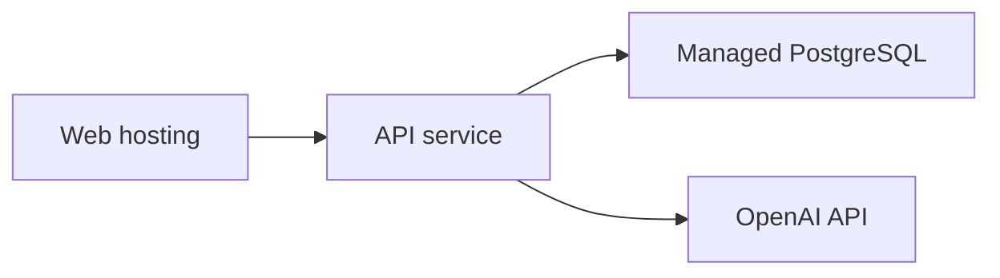

# Deployment

This project is designed to run locally with Docker Compose and can be deployed
as separate web, API, and PostgreSQL services.

## Local Docker

```bash
cp .env.example .env
make up
```

Services:

- Web: `http://localhost:3000`
- API: `http://localhost:8000`
- Database: PostgreSQL on `localhost:5432`

Useful commands:

```bash
make logs
make ps
make down
```

## Local Non-Docker

API:

```bash
cd apps/api
uv sync
uv run uvicorn src.main:app --reload --host 127.0.0.1 --port 8000
```

Web:

```bash
pnpm install
NEXT_PUBLIC_API_URL=http://127.0.0.1:8000 pnpm --dir apps/web dev
```

## Required Environment

Backend:

- Database URL for PostgreSQL.
- OpenAI API key for live LLM-backed runs.

Frontend:

- `NEXT_PUBLIC_API_URL` for browser-visible API calls.
- `API_INTERNAL_URL` when the web server should call an internal Docker/service
  hostname instead of the public API URL.

## Database Setup

The app uses SQLAlchemy models and Alembic migrations. A deployment should:

1. Provision PostgreSQL.
2. Apply migrations.
3. Seed prompt versions.
4. Optionally seed evaluation/demo data.

Seed commands:

```bash
cd apps/api
uv run python -m src.seed_prompts
uv run python -m src.seed_evaluation_cases
uv run python -m src.seed_demo_dataset
```

## Deployment Shape

Recommended service split:



Suitable portfolio deployment targets:

- Render
- Railway
- Fly.io
- Azure App Service / Container Apps

## Release Checklist

- API health endpoint returns `200`.
- Web app can reach API through configured URL.
- Migrations are applied.
- Prompt versions are seeded.
- Demo mode can seed the demo dataset.
- `/evaluation` and `/workflow-comparison` show baseline and multi-agent data.
- Secrets are configured outside source control.
- Full validation passes before deployment.

## Known Limits

- Auth and role-based permissions are deferred to later phases.
- Background jobs are not yet required for demo mode.
- Live LLM runs require valid provider credentials and quota.
- The deterministic demo path is intended for portfolio walkthroughs and does not
  replace live evaluation runs.
